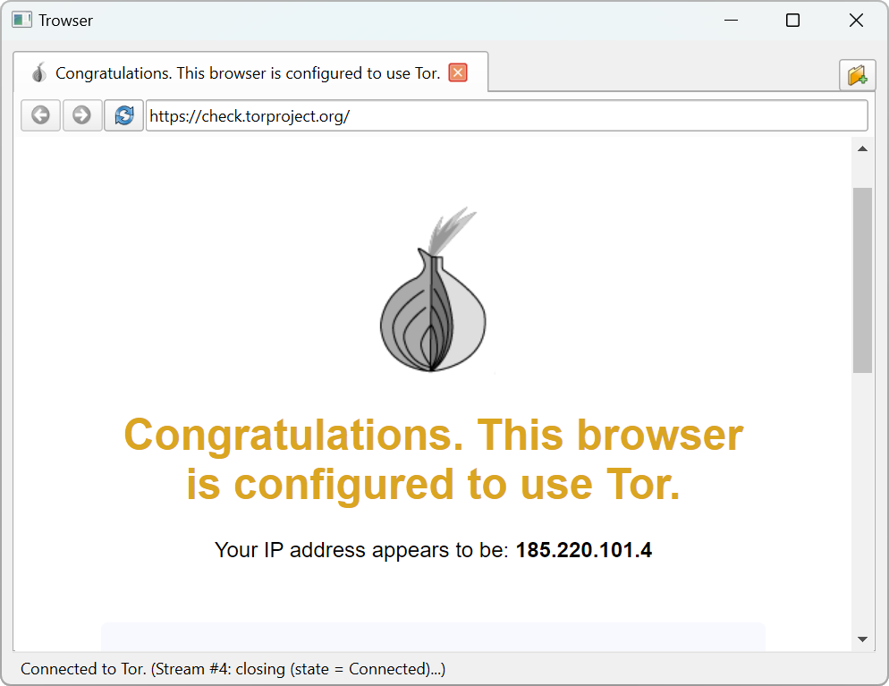

# Trowser
A Tor browser written in pure Python using <a href="https://pypi.org/project/PyQt6/">PyQt6</a> and <a href="https://pypi.org/project/torpy/">Torpy</a>. <strong>This is for educational purposes only, do not expect it to be secure or private!</strong>



# Dependencies
```
pip install PyQt6 PyQt6-WebEngine torpy
```
